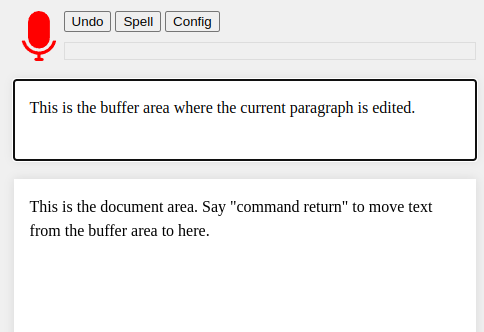
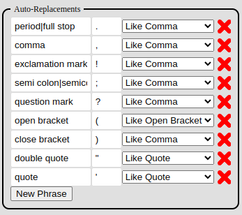
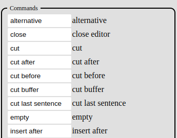

**Speech Editor** is a speech recognition based text editor web app.

Many speech recognition word processor apps already exist on the web but few offer any facilities for voice based editing. The user is required to dictate the entire document from beginning to end with no mistakes. It is also assumed that the speech recognition engine will recognise every word perfectly, which is rarely the case. Speech Editor offers editing facilities such that errors can be corrected by voice without using the keyboard.

## Online version

A version of [Speech Editor is available here (free)](https://leoncode.co.uk/apps/speech-editor/). 

### Usage

Speech Editor is based around paragraphs. The application is split into two parts. The top section is the 'buffer' area which holds the current paragraph being spoken. The lower section is the completed document. The user dictates a paragraph, which appears in the buffer area, and then adds it to the document by saying "command return". The user then dictates another paragraph and so on.

To start speech recognition click the microphone icon. Not all web browsers offer a speech recognition service. At the time of writing, Chrome does but Firefox does not. You also will likely need to grant permission in your browser to use the microphone on first use. An error message should pop up if speech recognition is unavailable.

If a mistake is made you can say "command undo" (or "command back" is equivalent) to remove the last utterance that the recogniser heard. It is also possible to remove the entire last sentence from the buffer by saying "command cut last sentence". It is best to speak in short fragments with pauses (less than a sentence at a time) such that less of the text needs to be erased and repeated when an error appears, which will be quite frequently.

The user can edit the words that are currently in the buffer section by saying "command words". This moves the buffer into the words editor. Each word is now prefixed by a number. The user can delete a word by saying "command cut" followed by the relevant number before the word that the user wishes to delete. Extra words can be inserted into the middle of a sentence by dictating the words into the buffer area and then saying "command insert after" followed by a number indicating the point in the text after which the words should be inserted. To finish editing say "command close".

Text can also be edited at the sentence level. If the user says "command sentences" then the buffer text is broken into individual sentences, each of which is prefixed by a number. As with words the user can delete a sentence by saying "command cut" followed by the relevant sentence number. The user can exchange the position of sentences by saying "command move up" or "command move down" followed by the relevant sentence number which will move the sentence up or down respectively.

The document can also be edited at the paragraph level by saying "command paragraphs". This replaces the document section with a list of numbered paragraphs. The paragraphs can then be cut, moved and otherwise edited just like sentences.

It is possible to have more than one editor open at once. The currently selected editor is highlighted in red. To change which editor is currently highlighted simply say "command" followed by "words", "sentences" or "paragraphs" as appropriate. To close an editor say "command close" and the highlighted editor will be closed. Be aware that closing the words or sentences editors moves any text contained within back into the buffer area and overwrites whatever is there. If using the paragraphs editor then the text goes back into the full document.

If the user says "command return" whilst the words editor is highlighted then the contents of the buffer are appended to the words editor instead of the document. Similarly if the sentence editor is highlighted and the user says "command return" then the contents of the buffer are added to the sentence editor.

Any paragraph or sentence can be brought back into the buffer area by saying "command restore" followed by the paragraph number or sentence number as appropriate. The buffer area can overwrite any paragraph, sentence or word by saying "command replace" followed by the relevant number.

Many more commands are available (see the reference at the end).

### Punctuation

The editor handles punctuation. To insert these characters simply say the name of the relevant punctuation mark such as "comma", "full stop" (or "period"), "question mark" or "exclamation mark". The available set of punctuation marks can be fully configured. If you click the "config" button, the list of available symbols and the phrase which triggers them is listed under "auto replacements". New punctuation marks can be added to the list and the trigger phrases changed. The configuration is saved into the browser and will remain if the web page is reloaded.

The drop-down menu to the right of each punctuation symbol defines the stylistic conventions that apply to the punctuation mark. For example a comma should typically be attached to the right of the preceding word and be followed by a space. To make another punctuation character follow this convention, choose "like comma" from the list. Other stylistic conventions are listed, choose the convention that is most appropriate for the character you wish to add.

If you wish to say the word "comma", or any other punctuation mark, prefix it with the word "literal". For example say the phrase "literal comma" in order to insert the literal word "comma" instead of the punctuation symbol. This only leaves the problem of how to say the word "literal" which is achieved by saying it twice i.e. "literal literal".

### Comand Word Config

All of the command words can be modified in the config area. If you do not find the specific word I have set to be very intuitive, it can be changed. It is possible to add more than one command word to mean the same action. Multiple command words can be separated with the '|' character (vertical bar or pipe). This is useful when a command word is persistently mis-recognised. All of the incorrectly recognised versions of the same command word can be added as alternative versions, which makes the speech recognition less frustrating to use as then any of the alternatives will trigger the command.

If the speech recogniser consistently fails to recognise a command word, you also try a completely different word or phrase that the recogniser can handle. For example, it almost never recognises the word "undo" correctly in my accent, so I have added "back" as an alternative which is more reliable. You can experiment to find which trigger words are most reliable for your accent.

The "command" trigger word itself can also be changed and have alternatives. I often find the recogniser hears "commander" and so I have this set as well.

### Spelling Mode

Sometimes the speech recogniser fails to type the correct word no matter what you try. This is particularly so with homophones. For example I can never get it to write the word "cache" which is pronounced as "cash", the recogniser prefers the latter. For this problem there is spelling mode. If you say "command spell" Speech Editor will go into a mode where it uses phonetic spelling. That is you can say "alpha" for "a" and "beta" for "b" and so on to spell out a word. You can say any word that starts with the right letter and do not have to use any particular phonetic alphabet. To cancel the mode say "command spell" again.

### Recogniser Alternatives

The speech recogniser sometimes produces several alternatives that it thought the user may have said. Where these are made available they are shown in the alternatives section below the buffer. If one of the alternatives is correct, you can say "command alternative" followed by the number and the text will be replaced with your selection.

## Full Comand List

**command alternative <number>** - The recogniser may present several versions of what it heard. Choose a recogniser alternative suggestion from alternatives section to replace what was heard in the buffer.

**command close** - Close the currently open editor that is highlighted in red. If closing words or sentences, the content of the editor will be moved back into the buffer section.

**command cut <number>** - Remove a specific numbered item from either the words, sentences or paragraphs editor. The removed item can subsequently be pasted.

**command cut after <number>** - Cut all text after the specified numbered item from the currently highlighted words, sentences or paragraphs editor.

**command cut before <number>** - Cut all text prior to the specified numbered item from the currently highlighted words, sentences or paragraphs editor.

**command cut buffer** - Cut all text currently in the buffer.

**command cut last sentence** - Cut the last sentence spoken into the buffer area.

**command empty** - Clear the buffer area.

**command insert after <number>** - Insert any text currently in the buffer area after the specified point in the presently highlighted words, sentences or paragraphs editor. A value a zero or "start" can be used to mean prior to the first item.

**command insert before <number>** - Insert any text currently in the buffer area prior to the specified point in the presently highlighted words, sentences or paragraphs editor.

**command lower case <number>** - Convert the specified word number to lower case.

**command move down <number>** - Move the specified sentence or paragraph, one position down in the editor.

**command move up <number>** - Move the specified sentence or paragraph, one position up in the editor.

**command paragraphs** - Open the paragraphs editor (hides the current document) or highlights the paragraph editor if currently open.

**command paste after <number>** - Paste what was previously cut after the specified item number in the words, sentences or paragraphs editor.

**command paste before <number>** - Paste what was previously cut before the specified item number in the words, sentences or paragraphs editor.

**command replace <number>** - Replace the numbered item in the words, sentences or paragraphs editor with the content of the buffer.

**command restore <number>** - Retrieve the numbered item in the sentences or paragraphs editor into the buffer.

**command return** - Append the content of the buffer area into the words to the sentences or paragraphs editor that is currently highlighted. Otherwise append the buffer area directly to the full document.

**command scroll down** - scroll down the highlighted editor or the full document.

**command scroll <number>** - Scroll to the numbered item in the highlighted editor.

**command scroll up** - scroll up the highlighted editor or the full document.

**command sentences** - Open the sentences editor and move the content of buffer area into it. If the editor is already open then highlight it.

**command shorten <number>** - Remove one character from the end of the specified word.

**command spell** - Enter spelling mode or cancel it if currently active. Anything that is now said will be interpreted as a phonetic alphabet e.g. "alpha" means "a" and "beta" means "b" etc.

**command title case <number>** - Make the first character of the chosen word a capital letter.

**command upper case <number>** - Convert the chosen word to upper case.

**command words** - Open the words editor, moving the content of the buffer area into it, or selector the editor if not currently open.
